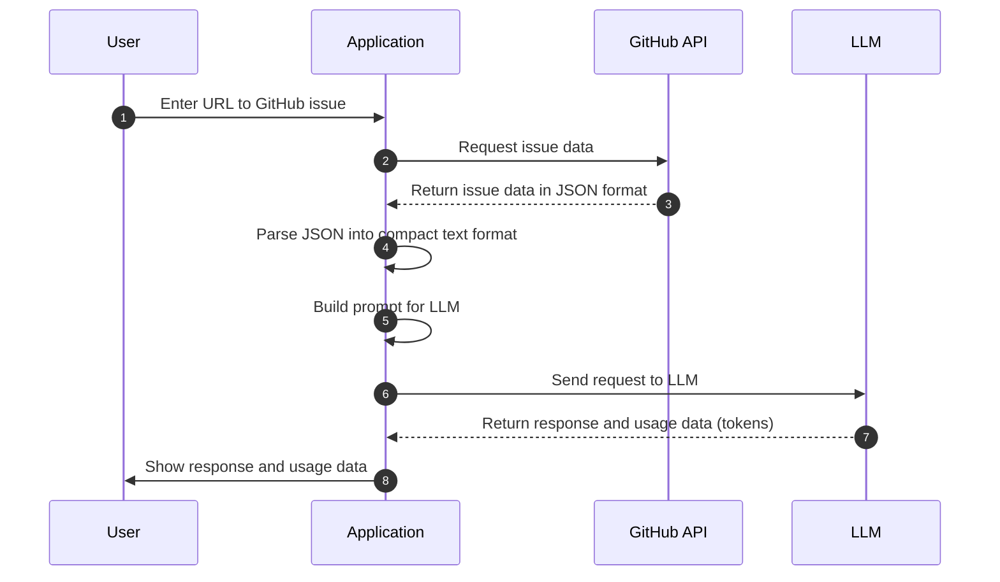
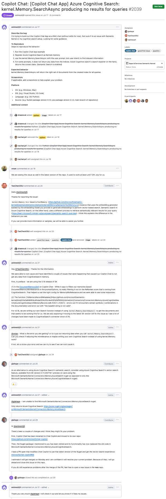
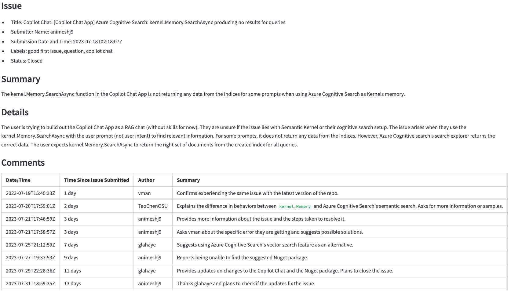

# Using LLMs to summarize GitHub issues

This project is a learning exercise on using large language models (LLMs) for summarization. It uses GitHub issues as a practical use case that we can relate to. The goal is to allow developers to understand what is being reported and discussed in the issues without having to read each message in the thread.

We will review the following topics:

1. How good are LLMs at summarizing text and GitHub issues in particular.
1. Some of their limitations, such as the context window size.
1. Security concerns.
1. Their performance (how long it takes to generate a summary) and costs.

## What happens behind the scenes

Before we start, let's review what happens behind the scenes when we use LLMs to summarize GitHub issues.

The following diagram shows the main steps:

- _Get the issue and its comments from GitHub_: The application converts the issue URL the user entered in (1) to a GitHub API URL and requests the issue, then the comments (2). The GitHub API returns the issue and comments in JSON format (3).
- _Preprocess the data_: The application converts the JSON data into a compact text format (4) that the LLM can process. This is important to reduce token usage and costs.
- _Build the prompt_: The application builds a prompt (5) for the LLM. The prompt is a text that tells the LLM what to do.
- _Send the request to the LLM_: The application sends the prompt to the LLM (6) and waits for the response.
- _Process the LLM response_: The application receives the response from the LLM (7) and shows it to the user (8).



We will now review each step in more detail.

## Summarizing GitHub issues

We will now work through a few examples of summarizing GitHub issues to see how the LLMs behave.

We will go from this (click to enlarge)...

<!-- markdownlint-disable-next-line MD033 -->


...to this  (click to enlarge):

<!-- markdownlint-disable-next-line MD033 -->


If you haven't done so yet, [prepare the environment](#preparing-the-environment).

Run the following commands to activate the environment and start the application in a browser.

```bash
source venv/bin/activate
streamlit run app.py
```

## Design

This section describes the project design. It is not necessary to read it to use the project.

There are three main steps:

1. [Fetching data](#fetching-data): Fetch the comments posted in the GitHub issue. This will return large JSON objects.
1. [Preprocessing data](#preprocessing-data): Convert the JSON objects into a format that the LLM can use. The goal here is to reduce the amount of data to process and to remove irrelevant information. Concise data helps the LLM focus on important information and reduces costs using fewer tokens.
1. [Extracting information with an LLM](#extracting-information-with-a-llm): Use the LLM to extract the information from the preprocessed data.

### Fetching data

### Preprocessing data

### Extracting information with a LLM

## Modifying and testing the code

Use the CLI code in `cli.py` to test modifications to the code. It's easier to debug code in a CLI than in a Streamlit app. Adapt the Streamlit app once the code works in the CLI.

## Preparing the environment

This is a one-time step. If you have already done this, just activate the virtual environment with `source venv/bin/activate`.

There are two steps to prepare the environment.

1. [Python environment](#python-environment)
1. [OpenAI API key](#openai-api-key)

### Python environment

Run the following commands to create a virtual environment and install the required packages.

```bash
python3 -m venv venv
source venv/bin/activate
pip install --upgrade pip
pip install -r requirements.txt

# Install the new OpenAI Python package manually until it is released
# See comments in requirements.txt for more information
pip install --pre openai
```

### OpenAI API key

The code uses [OpenAI GPT models](https://platform.openai.com/docs/models) to generate summaries. It's currently one of the easiest ways to get started with LLMs. While OpenAI charges for API access, it gives a US $5 credit that can go a long way in small projects that use GPT-3.5 models. It is enough for about two to three million tokens with GPT-3.5 models (as of [October 2023](https://openai.com/pricing)). To avoid surprise bills, you can set [spending limits](https://platform.openai.com/docs/guides/production-best-practices/managing-billing-limits).

If you already have an OpenAI account, create an API key [here](https://platform.openai.com/account/api-keys). If you don't have an account, create one [here](https://openai.com/product#made-for-developers).

Once you have the OpenAI API key, create a `.env` file in the project root directory with the following content.

```bash
OPENAI_API_KEY=<your key>
```

It is safe to add the key here. It will never be committed to the repository.
