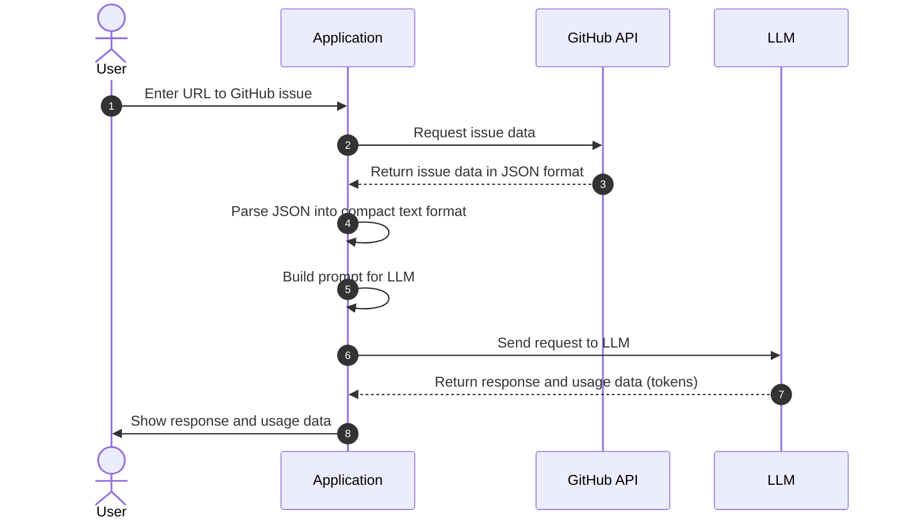

# Using LLMs to summarize GitHub issues

This project is a learning exercise on using large language models (LLMs) for summarization. It uses GitHub issues as a practical use case that we can relate to.

The goal is to allow developers to understand what is being reported and discussed in the issues without having to read each message in the thread. We will take the [original GitHub issue with its comments](./docs/github-issue-original.jpg) and generate a summary like [this one](./docs/github-issue-summarized.jpg).

We will review the following topics:

1. How to prepare data to use with an LLM.
1. How to build a prompt to summarize data.
1. How good are LLMs at summarizing text and GitHub issues in particular.
1. Some of their limitations, such as the context window size.
1. Security concerns.
1. Their performance (how long it takes to generate a summary) and costs.

## Overview of the steps

Before we start, let's review what happens behind the scenes when we use LLMs to summarize GitHub issues.

The following diagram shows the main steps:

- _Get the issue and its comments from GitHub_: The application converts the issue URL the user entered in (1) to a GitHub API URL and requests the issue, then the comments (2). The GitHub API returns the issue and comments in JSON format (3).
- _Preprocess the data_: The application converts the JSON data into a compact text format (4) that the LLM can process. This is important to reduce token usage and costs.
- _Build the prompt_: The application builds a prompt (5) for the LLM. The prompt is a text that tells the LLM what to do.
- _Send the request to the LLM_: The application sends the prompt to the LLM (6) and waits for the response.
- _Process the LLM response_: The application receives the response from the LLM (7) and shows it to the user (8).



We will now review each step in more detail.

## Quick get-started guide

This section describes the steps to go from a GitHub issue like [this one](https://github.com/microsoft/semantic-kernel/issues/2039) (click to enlarge)...

<!-- markdownlint-disable-next-line MD033 -->


...to LLM-generated summary (click to enlarge):

<!-- markdownlint-disable-next-line MD033 -->


First, [prepare the environment](#preparing-the-environment), if you haven't done so yet.

Run the following commands to activate the environment and start the application in a browser.

```bash
source venv/bin/activate
streamlit run app.py
```

Once the application is running, enter the URL for the issue above, `https://github.com/microsoft/semantic-kernel/issues/2039`, and press the `Generate summary with <model>` button to generate the summary. It will take a few seconds to complete.

**NOTES**:

- Large language models are not deterministic and may be updated anytime. The results you get may be different from the ones shown here.
- The GitHub issue may have been updated since the screenshots were taken.

In the next sections, we will go behind the scenes to see how the application works.

## What happens behind the scenes

This section describes the steps to go from a GitHub issue to a summary.

### Step 1 - Get the GitHub issue and its comments

The first step is to get the raw data using the GitHub API. In this step we translate the URL the user entered into a GitHub API URL and request the issue and its comments. For example, the URL `https://github.com/microsoft/semantic-kernel/issues/2039` is translated into `https://api.github.com/repos/microsoft/semantic-kernel/issues/2039`. The GitHub API returns a JSON object with the issue. [Click here](https://api.github.com/repos/microsoft/semantic-kernel/issues/2039) to see the JSON object for the issue.

The issue has a link its comments:

```text
"comments_url": "https://api.github.com/repos/microsoft/semantic-kernel/issues/2039/comments",
```

We use that URL to request the comments and get another JSON object. [Click here](https://api.github.com/repos/microsoft/semantic-kernel/issues/2039/comments) to see the JSON object for the comments.

### Step 2 - Translate the JSON data into a compact text format

The JSON objects have more information than we need. Before sending the request to the LLM, we need to extract the pieces we need for the following reasons:

1. Large objects cost more because [most LLMs charge per token](https://openai.com/pricing).
1. It takes longer to process large objects.
1. Large objects may not fit in the LLM's context window (the context window is the number of tokens the LLM can process at a time).

In this step, we take the JSON objects and convert them into a compact text format. The text format is easier to process and takes less space than the JSON objects.

This is the start of the JSON object returned by the GitHub API for the issue:

```text
{
  "url": "https://api.github.com/repos/microsoft/semantic-kernel/issues/2039",
  "repository_url": "https://api.github.com/repos/microsoft/semantic-kernel",
  "labels_url": "https://api.github.com/repos/microsoft/semantic-kernel/issues/2039/labels{/name}",
  "comments_url": "https://api.github.com/repos/microsoft/semantic-kernel/issues/2039/comments",
  "events_url": "https://api.github.com/repos/microsoft/semantic-kernel/issues/2039/events",
  "html_url": "https://github.com/microsoft/semantic-kernel/issues/2039",
  "id": 1808939848,
  "node_id": "I_kwDOJDJ_Yc5r0jtI",
  "number": 2039,
  "title": "Copilot Chat: [Copilot Chat App] Azure Cognitive Search: kernel.Memory.SearchAsync producing no   ...

  "body": "**Describe the bug**\r\nI'm trying to build out the Copilot Chat App as a RAG chat (without
           skills for now). Not sure if its an issue with Semantic Kernel or my cognitive search...
           ...many lines removed for brevity...
           package version 0.1.0, pip package version 0.1.0, main branch of repository]\r\n\r\n**Additional
           context**\r\n",
   ...
```

And this is the compact text format we create out of it:

```text
Title: Copilot Chat: [Copilot Chat App] Azure Cognitive Search: kernel.Memory.SearchAsync producing no
results for queries
Body (between '''):
'''
**Describe the bug**
I'm trying to build out the Copilot Chat App as a RAG chat (without skills for now). Not sure if its an
issue with Semantic Kernel or my cognitive search setup. Looking for some guidance.
...many lines removed for brevity...
```

To get from the JSON object to the compact text format we do the following:

- Remove all fields we don't need for the summary. For example, `repository_url`, `node_id`, and many others.
- Change from JSON to plain text format. For example, `{"title": "Copilot Chat: [Copilot Chat App] Azure ...` becomes `Title: Copilot Chat: [Copilot Chat App] Azure ...`.
- Remove spaces and quotes. They count as tokens, which increase costs and processing time.
- Add a few hints to guide the LLM. For example, `Body (between ''')` tells the LLM that the body of the issue is between the `'''` characters.

[Click here](./docs/post-processed-issue-comments.txt) to see the result of this step. Compare with the JSON object for the [issue](https://api.github.com/repos/microsoft/semantic-kernel/issues/2039) and [comments](https://api.github.com/repos/microsoft/semantic-kernel/issues/2039/comments) to see how much smaller the text format is.

### Step 3 - Build the prompt

A [prompt](https://developers.google.com/machine-learning/resources/prompt-eng) tells the LLM what to do, along with the data it needs.

In our case, we want the LLM to summarize the GitHub issue and the comments. Therefore, we need three pieces in our prompt:

1. Clear instructions on what to do.
1. The GitHub issue needed to generate the summary.
1. The issues comments needed to generate the summary.

Our prompt is stored in [this file](./llm.ini). The prompt has instructions to the LLM to summarize the issue and the comments in the format we want (the _"Don't waste..."_ part comes from [this example](https://learn.microsoft.com/en-us/semantic-kernel/ai-orchestration/plugins/)).

```text
You are an experienced developer familiar with GitHub issues.
    The following text was parsed from a GitHub issue and its comments.
    Extract the following information from the issue and comments:
    - Issue: A list with the following items: title, the submitter name, the submission date and
      time, labels, and status (whether the issue is still open or closed).
    - Summary: A summary of the issue in precisely one short sentence of no more than 50 words.
    - Details: A longer summary of the issue. If code has been provided, list the pieces of code
      that cause the issue in the summary.
    - Comments: A table with a summary of each comment in chronological order with the columns:
      date/time, time since the issue was submitted, author, and a summary of the comment.
    Don't waste words. Use short, clear, complete sentences. Use active voice. Maximize detail, meaning focus on the content. Quote code snippets if they are relevant.
    Answer in markdown with section headers separating each of the parts above.
    The issue text and comments start here:
```

See [this site](https://www.promptingguide.ai/) for more information on how to write prompts.

### Step 4 - Send the request to the LLM

### Step 5 - Show the response


## Design

This section describes the project design. It is not necessary to read it to use the project.

There are three main steps:

1. [Fetching data](#fetching-data): Fetch the comments posted in the GitHub issue. This will return large JSON objects.
1. [Preprocessing data](#preprocessing-data): Convert the JSON objects into a format that the LLM can use. The goal here is to reduce the amount of data to process and to remove irrelevant information. Concise data helps the LLM focus on important information and reduces costs using fewer tokens.
1. [Extracting information with an LLM](#extracting-information-with-a-llm): Use the LLM to extract the information from the preprocessed data.

### Fetching data

### Preprocessing data

### Extracting information with a LLM

## Modifying and testing the code

Use the CLI code in `cli.py` to test modifications to the code. It's easier to debug code in a CLI than in a Streamlit app. Adapt the Streamlit app once the code works in the CLI.

## Preparing the environment

This is a one-time step. If you have already done this, just activate the virtual environment with `source venv/bin/activate`.

There are two steps to prepare the environment.

1. [Python environment](#python-environment)
1. [OpenAI API key](#openai-api-key)

### Python environment

Run the following commands to create a virtual environment and install the required packages.

```bash
python3 -m venv venv
source venv/bin/activate
pip install --upgrade pip
pip install -r requirements.txt

# Install the new OpenAI Python package manually until it is released
# See comments in requirements.txt for more information
pip install --pre openai
```

### OpenAI API key

The code uses [OpenAI GPT models](https://platform.openai.com/docs/models) to generate summaries. It's currently one of the easiest ways to get started with LLMs. While OpenAI charges for API access, it gives a US $5 credit that can go a long way in small projects that use GPT-3.5 models. It is enough for about two to three million tokens with GPT-3.5 models (as of [October 2023](https://openai.com/pricing)). To avoid surprise bills, you can set [spending limits](https://platform.openai.com/docs/guides/production-best-practices/managing-billing-limits).

If you already have an OpenAI account, create an API key [here](https://platform.openai.com/account/api-keys). If you don't have an account, create one [here](https://openai.com/product#made-for-developers).

Once you have the OpenAI API key, create a `.env` file in the project root directory with the following content.

```bash
OPENAI_API_KEY=<your key>
```

It is safe to add the key here. It will never be committed to the repository.
