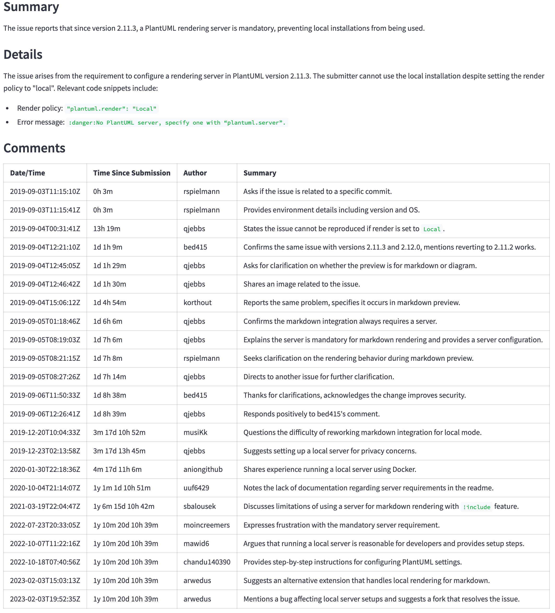
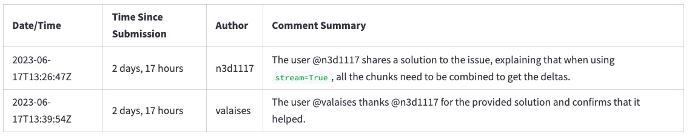

# Using LLMs to summarize GitHub issues

This project is a learning exercise on using large language models (LLMs) for summarization. It uses GitHub issues as a practical use case that we can relate to.

The goal is to allow developers to understand what is being reported and discussed in the issues without having to read each message in the thread. We will take the [original GitHub issue with its comments](./docs/github-issue-original.jpg) and generate a summary like [this one](./docs/github-issue-summarized.jpg).

**UPDATE 2024-07-21**: With the [announcement of GPT-4o mini](https://openai.com/index/gpt-4o-mini-advancing-cost-efficient-intelligence/), there are fewer and fewer reasons to use GPT-3.5 models. I updated the code to use the GPT-4o and GPT-4o mini models and to remove the GPT-4 Turbo models (they are listed under ["older models we support"](https://openai.com/api/pricing/), hinting that they will eventually be removed).

We will review the following topics:

1. How to prepare data to use with an LLM.
1. How to build a prompt to summarize data.
1. How good are LLMs at summarizing text and GitHub issues in particular.
1. Developing applications with LLMs: some of their limitations, such as the context window size.
1. The role of prompts in LLMs and how to create good prompts.
1. When not to use LLMs.

This [YouTube video](https://youtu.be/5sDD0WNDZkc) walks through the sections below, but note that it uses the first version of the code. The code has been updated since then.

## Overview of the steps

Before we start, let's review what happens behind the scenes when we use LLMs to summarize GitHub issues.

The following diagram shows the main steps:

- _Get the issue and its comments from GitHub_: The application converts the issue URL the user entered in (1) to a GitHub API URL and requests the issue, then the comments (2). The GitHub API returns the issue and comments in JSON format (3).
- _Preprocess the data_: The application converts the JSON data into a compact text format (4) that the LLM can process. This is important to reduce token usage and costs.
- _Build the prompt_: The application builds a prompt (5) for the LLM. The prompt is a text that tells the LLM what to do.
- _Send the request to the LLM_: The application sends the prompt to the LLM (6) and waits for the response.
- _Process the LLM response_: The application receives the response from the LLM (7) and shows it to the user (8).


We will now review each step in more detail.

## Quick get-started guide

This section describes the steps to go from a GitHub issue like [this one](https://github.com/microsoft/semantic-kernel/issues/2039) (click to enlarge)...

<!-- markdownlint-disable-next-line MD033 -->


...to LLM-generated summary (click to enlarge):

<!-- markdownlint-disable-next-line MD033 -->


First, [prepare the environment](#preparing-the-environment), if you haven't done so yet.

Run the following commands to activate the environment and start the application in a browser.

```bash
source venv/bin/activate
streamlit run app.py
```

Once the application is running, enter the URL for the above issue, `https://github.com/microsoft/semantic-kernel/issues/2039`, and click the `Generate summary with <model>` button to generate the summary. It will take a few seconds to complete.

**NOTES**:

- Large language models are not deterministic and may be updated anytime. The results you get may be different from the ones shown here.
- The GitHub issue may have been updated since the screenshots were taken.

In the following sections, we will go behind the scenes to see how the application works.

## What happens behind the scenes

This section describes the steps to summarize a GitHub issue using LLMs. We will start by fetching the issue data, preprocessing it, building an appropriate prompt, sending it to the LLM, and finally, processing the response.

### Step 1 - Get the GitHub issue and its comments

The first step is to get the raw data using the GitHub API. In this step we translate the URL the user entered into a GitHub API URL and request the issue and its comments. For example, the URL `https://github.com/microsoft/semantic-kernel/issues/2039` is translated into `https://api.github.com/repos/microsoft/semantic-kernel/issues/2039`. The GitHub API returns a JSON object with the issue. [Click here](https://api.github.com/repos/microsoft/semantic-kernel/issues/2039) to see the JSON object for the issue.

The issue has a link to its comments:

```text
"comments_url": "https://api.github.com/repos/microsoft/semantic-kernel/issues/2039/comments",
```

We use that URL to request the comments and get another JSON object. [Click here](https://api.github.com/repos/microsoft/semantic-kernel/issues/2039/comments) to see the JSON object for the comments.

### Step 2 - Translate the JSON data into a compact text format

The JSON objects have more information than we need. Before sending the request to the LLM, we need to extract the pieces we need for the following reasons:

1. Large objects cost more because [most LLMs charge per token](https://openai.com/pricing).
1. It takes longer to process large objects.
1. Large objects may not fit in the LLM's context window (the context window is the number of tokens the LLM can process at a time).

In this step, we convert the JSON objects into a compact text format. The text format is easier to process and takes less space than the JSON objects.

This is the start of the JSON object returned by the GitHub API for the issue.

```text
{
  "url": "https://api.github.com/repos/microsoft/semantic-kernel/issues/2039",
  "repository_url": "https://api.github.com/repos/microsoft/semantic-kernel",
  "labels_url": "https://api.github.com/repos/microsoft/semantic-kernel/issues/2039/labels{/name}",
  "comments_url": "https://api.github.com/repos/microsoft/semantic-kernel/issues/2039/comments",
  "events_url": "https://api.github.com/repos/microsoft/semantic-kernel/issues/2039/events",
  "html_url": "https://github.com/microsoft/semantic-kernel/issues/2039",
  "id": 1808939848,
  "node_id": "I_kwDOJDJ_Yc5r0jtI",
  "number": 2039,
  "title": "Copilot Chat: [Copilot Chat App] Azure Cognitive Search: kernel.Memory.SearchAsync producing no   ...

  "body": "**Describe the bug**\r\nI'm trying to build out the Copilot Chat App as a RAG chat (without
           skills for now). Not sure if its an issue with Semantic Kernel or my cognitive search...
           ...many lines removed for brevity...
           package version 0.1.0, pip package version 0.1.0, main branch of repository]\r\n\r\n**Additional
           context**\r\n",
   ...
```

And this is the compact text format we create out of it.

```text
Title: Copilot Chat: [Copilot Chat App] Azure Cognitive Search: kernel.Memory.SearchAsync producing no
results for queries
Body (between '''):
'''
**Describe the bug**
I'm trying to build out the Copilot Chat App as a RAG chat (without skills for now). Not sure if its an
issue with Semantic Kernel or my cognitive search setup. Looking for some guidance.
...many lines removed for brevity...
```

To get from the JSON object to the compact text format, we do the following:

- Remove all fields we don't need for the summary. For example, `repository_url`, `node_id`, and many others.
- Change from JSON to plain text format. For example, `{"title": "Copilot Chat: [Copilot Chat App] Azure ...` becomes `Title: Copilot Chat: [Copilot Chat App] Azure ...`.
- Remove spaces and quotes. They count as tokens, which increase costs and processing time.
- Add a few hints to guide the LLM. For example, `Body (between ''')` tells the LLM that the body of the issue is between the `'''` characters.

[Click here](./docs/post-processed-issue-comments.txt) to see the result of this step. Compare with the JSON object for the [issue](https://api.github.com/repos/microsoft/semantic-kernel/issues/2039) and [comments](https://api.github.com/repos/microsoft/semantic-kernel/issues/2039/comments) to see how much smaller the text format is.

### Step 3 - Build the prompt

A [prompt](https://developers.google.com/machine-learning/resources/prompt-eng) tells the LLM what to do, along with the data it needs.

Our prompt is stored in [this file](./llm.ini). The prompt instructs the LLM to summarize the issue and the comments in the format we want (the _"Don't waste..."_ part comes from [this example](https://learn.microsoft.com/en-us/semantic-kernel/ai-orchestration/plugins/)).

```text
You are an experienced developer familiar with GitHub issues.
The following text was parsed from a GitHub issue and its comments.
Extract the following information from the issue and comments:
- Issue: A list with the following items: title, the submitter name, the submission date and
  time, labels, and status (whether the issue is still open or closed).
- Summary: A summary of the issue in precisely one short sentence of no more than 50 words.
- Details: A longer summary of the issue. If code has been provided, list the pieces of code
  that cause the issue in the summary.
- Comments: A table with a summary of each comment in chronological order with the columns:
  date/time, time since the issue was submitted, author, and a summary of the comment.
Don't waste words. Use short, clear, complete sentences. Use active voice. Maximize detail, meaning focus on the content. Quote code snippets if they are relevant.
Answer in markdown with section headers separating each of the parts above.
```

### Step 4 - Send the request to the LLM

We now have all the pieces we need to send the request to the LLM. Different LLMs have different APIs, but most of them have a variation of the following parameters:

- The model: The LLM to use. As a general rule, larger models are better but are also more expensive and take more time to build the response.
- System prompt: The instructions we send to the LLM to tell it what to do, what format to use, and so on. This is usually not visible to the user.
- The user input: The data the user enters in the application. In our case, the user enters the URL for the GitHub issue and we use it to create the actual user input (the parsed issue and comments).
- The temperature: The higher the temperature, the more creative the LLM is. The lower the temperature, the more predictable it is. We use a temperature of 0.0 to get more precise and consistent results.

These are the main ones we use in this project. There are [other parameters](https://txt.cohere.com/llm-parameters-best-outputs-language-ai/) we can adjust for other use cases.

This is the relevant code in [llm.py](./llm.py):

```python
    completion = client.chat.completions.create(
        model=model,
        messages=[
            {"role": "system", "content": prompt},
            {"role": "user", "content": user_input},
        ],
        temperature=0.0  # We want precise and repeatable results
    )
```

### Step 5 - Show the response

The LLM returns a JSON object with the response and usage data. We show the response to the user and use the usage data to calculate the cost of the request.

This is a sample response from the LLM (using the [OpenAI API](https://platform.openai.com/docs/guides/gpt/chat-completions-api)):

```python
ChatCompletion(..., choices=[Choice(finish_reason='stop', index=0, message=ChatCompletionMessage(content=
'<response removed to save space>', role='assistant', function_call=None))], created=1698528558,
model='gpt-3.5-turbo-0613', object='chat.completion', usage=CompletionUsage(completion_tokens=304,
prompt_tokens=1301, total_tokens=1605))
```

Besides the response, we get the token usage. The cost is not part of the response. We must calculate that ourselves following the [published pricing rules](https://openai.com/pricing).

At this point, we have everything we need to show the response to the user.

## Developing applications with LLMs

In this section, we will review a few examples of how to use LLMs in applications. We will start with simple cases that work well and then move on to cases where things don't behave as expected and how to work around them.

This is a summary of what is covered in the following sections.

1. [A simple GitHub issue first to see how LLMs can summarize](#a-simple-github-issue-to-get-started).
1. [A large GitHub issue that doesn't fit in the context window of a basic LLM](#a-large-github-issue).
1. [A more powerful model for a better summary](#better-summaries-with-a-more-powerful-model).
1. [The introduction of GPT-4o mini](#the-introduction-of-gpt-4o-mini).
1. [The importance of using a good prompt](#the-importance-of-using-a-good-prompt).
1. [Sometimes we should not use an LLM](#if-all-we-have-is-a-hammer).

### A simple GitHub issue to get started

We will start with a simple case to see how well LLMs can summarize.

Start the user interface with the following command.

```bash
source venv/bin/activate
streamlit run app.py
```

Then choose the first issue in the list of samples, _`<https://github.com/openai/openai-python/issues/488> (simple example)`_ and click the _"Generate summary with..."_ button.

<!-- markdownlint-disable-next-line MD033 -->


After a few seconds, we should get a summary like the picture below. At the top we can see the token count, the cost (derived from the token count), and how long it took for the LLM to generate the summary. After that we see the LLM's response. Compared with the [original GitHub issue](https://github.com/openai/openai-python/issues/488), the LLM does a good job summarizing the issue's main points and the comments. At a glance, we can see the main points of the issue and its comments.

<!-- markdownlint-disable-next-line MD033 -->


### A large GitHub issue

Now choose the issue _`https://github.com/scikit-learn/scikit-learn/issues/9354 ...`_ and click the _"Generate summary with..."_ button. Do not change the LLM model yet.

It will fail with this error:

> `Error code: 400 - {'error': {'message': "This model's maximum context length is 16385 tokens. However, your messages resulted in 20437 tokens. Please reduce the length of the messages.", 'type': 'invalid_request_error', 'param': 'messages', 'code': 'context_length_exceeded'}}`

Each LLM has a limit on the number of tokens it can process at a time. This limit is the _context window_ size. The context window must fit the information we want to summarize and the summary itself. If the information we want to summarize is larger than the context window, as we saw in this case, the LLM will reject the request.

There are a few ways to work around this problem:

- Break up the information into smaller pieces that fit in the context window. For example, we could [ask for a summary of each comment separately](https://github.com/microsoft/azure-openai-design-patterns/blob/main/patterns/01-large-document-summarization/README.md), then combine them into a single summary to show to the user. This may not work well in all cases, for example, if one comment refers to another.
- Use a model with a larger context window.

We will use the second option. Click on _"Click to configure the prompt and the model"_ at the top of the screen, select the GPT-4o model and click the _"Generate summary with gpt-4o"_ button.

<!-- markdownlint-disable-next-line MD033 -->


Now, we get a summary from the LLM. However, note that it will take longer to generate the summary and cost more.

Why don't we start with GPT-4o to avoid such problems? Money. As a general rule, LLMs with larger context windows cost more. If we use an AI provider such as OpenAI, we must [pay more per token](https://openai.com/pricing). If we run the model ourselves, we need to buy more powerful hardware. Either way, using a larger context window costs more.

### Better summaries with a more powerful model

As a result of using GPT-4o, we also get better summaries.

Why don't we use GPT-4o from the start? In addition to the above reason (money), there is also higher latency. As a general rule, better models are also larger. They need more hardware to run, translating into [higher costs per token](https://openai.com/pricing) and a longer time to generate a response.

We can see the difference comparing the token count, cost, and time to generate the summary between the gpt-3.5-turbo and the gpt-4o models.

How do we pick a model? It depends on the use case. Start with the smallest (and thus cheaper and faster) model that produces good results. Create some heuristics to decide when to use a more powerful model. For example, switch to a larger model if the comments are larger than a certain size and if the users are willing to wait longer for better results (sometimes an average result faster is better than the perfect result later).

### The introduction of GPT-4o mini

The previous sections compared GPT-3.5 Turbo against GPT-4o to emphasize the differences between a smaller and a much larger model. However, in July 2024, OpenAI introduced the [GPT-4o mini model](https://openai.com/index/gpt-4o-mini-advancing-cost-efficient-intelligence/). It comes with the same 128k tokens context window as the GPT-4o model but with a much lower cost. It's even cheaper than the GPT-3.5 models. See the [OpenAI API pricing](https://openai.com/api/pricing/) for details.

GPT-4o (not mini) is still a better model, but its price and latency may not justify the better results. For example, the following table shows the summary for a large issue (`https://github.com/qjebbs/vscode-plantuml/issues/255`). GPT-4o is on the left, and GPT-4o mini is on the mini. The difference in costs is staggering, but the results are not that much different.

The message is that unless you have a specific reason for using GPT-3.5 Turbo, you should start a new project with the GPT-4o mini model. It will produce results comparable to GPT-4o for less than the GPT-3.5 Turbo cost.

| GPT-4o summary | GPT-4o mini summary |
|---------|---------|
| 3,859 tokens, US $0.0303 | 4,060, tokens, US $0.0012 |
|  |  |

### The importance of using a good prompt

Precise instructions in the prompt are important to get good results. To illustrate what a difference a good prompt makes:

1. Select the _"gpt-3.5-turbo"_ model.
1. Select the GitHub issue `https://github.com/openai/openai-python/issues/488` from the sample list.
1. Click the _"Generate summary with gpt-3.5-turbo"_ button.

We get a summary of the comments like this one.

<!-- markdownlint-disable-next-line MD033 -->


If we remove from the prompt the line _"Don't waste words. Use short, clear, complete sentences. Use active voice. Maximize detail, meaning focus on the content. Quote code snippets if they are relevant."_, we get this summary. Note how the text is more verbose and is indeed "wasting words".

<!-- markdownlint-disable-next-line MD033 -->


To remove the line, click on _"Click to configure the prompt and the model"_ at the top of the screen and remove the line from the prompt, then click on the _"Generate summary with..."_ button again. Reload the page to restore the line.

Getting the prompt right is still an experimental process. It goes under the name of _prompt engineering_. These are some references to learn more about prompt engineering.

- [Prompt engineering techniques (Azure)](https://learn.microsoft.com/en-us/azure/ai-services/openai/concepts/advanced-prompt-engineering)
- [GPT best practices (OpenAI)](https://platform.openai.com/docs/guides/gpt-best-practices)
- [Prompt engineering guide](https://www.promptingguide.ai/)

<!-- markdownlint-disable-next-line MD026 -->
### If all we have is a hammer...

Once we learn we can summarize texts with an LLM, we are tempted to use it for everything. Let's say we also want to know the number of comments on the issue. We could ask the LLM by adding it to the prompt.

Click on _"Click to configure the prompt and the model"_ at the top of the screen and add the line `- Number of comments in the issue` to the prompt as shown below. Leave all other lines unchanged.

```text
You are an experienced developer familiar with GitHub issues.
The following text was parsed from a GitHub issue and its comments.
Extract the following information from the issue and comments:
- Issue: A list with the following items: title, the submitter name, the submission date and
time, labels, and status (whether the issue is still open or closed).
- Number of comments in the issue  <-- ** ADD THIS LINE **
...remainder of the lines...
```

The LLM will return _a_ number of comments, but it will usually be wrong. Select, for example, the issue `https://github.com/qjebbs/vscode-plantuml/issues/255` from the sample list. None of the models get the number of comments correctly.

Why? Because **LLMs are not "executing" instructions**, they are simply [generating one token at a time](https://writings.stephenwolfram.com/2023/02/what-is-chatgpt-doing-and-why-does-it-work/).

This is an important concept to keep in mind. **LLMs do not understand what the text means**. They just pick the next token based on the previous ones. They are not a replacement for code.

What to do instead? If we have easy access to the information we want, we should just use it. In this case, we can get the number of comments from the GitHub API response.

```python
    issue, comments = get_github_data(st.session_state.issue_url)
    num_comments = len(comments)  # <--- This is all we need
```

## What we learned in these experiments

- LLMs are good at summarizing text if we use the right prompt.
- Summarizing larger documents requires larger context windows or more sophisticated techniques.
- Getting good results requires good prompts. Good prompts are still an experimental process.
- Sometimes, we should not use an LLM. If we can easily get the information we need from the data, we should do that instead of using an LLM.

## Modifying and testing the code

Use the CLI code in `cli.py` to test modifications to the code. Debugging code in a CLI is easier than in a Streamlit app. Once the code works in the CLI, adapt the Streamlit app.

## Preparing the environment

This is a one-time step. If you have already done this, just activate the virtual environment with `source venv/bin/activate`.

There are two steps to prepare the environment.

1. [Python environment](#python-environment)
1. [OpenAI API key](#openai-api-key)

### Python environment

Run the following commands to create a virtual environment and install the required packages.

```bash
python3 -m venv venv
source venv/bin/activate
pip install --upgrade pip
pip install -r requirements.txt
```

### OpenAI API key

The code uses [OpenAI GPT models](https://platform.openai.com/docs/models) to generate summaries. It's currently one of the easiest ways to get started with LLMs. While OpenAI charges for API access, it gives a US $5 credit that can go a long way in small projects that use the GPT-4o mini model. To avoid surprise bills, you can set [spending limits](https://platform.openai.com/docs/guides/production-best-practices/managing-billing-limits).

If you already have an OpenAI account, create an API key [here](https://platform.openai.com/account/api-keys). If you don't have an account, create one [here](https://openai.com/product#made-for-developers).

Once you have the OpenAI API key, create a `.env` file in the project root directory with the following content.

```bash
OPENAI_API_KEY=<your key>
```

It is safe to add the key here. It will never be committed to the repository.

## Related projects

[This project](https://github.com/fau-masters-collected-works-cgarbin/gpt-all-local) lets you ask questions on a document and get answers from an LLM. It uses techniques similar to this project but with a significant difference: the LLM runs locally on your computer.
